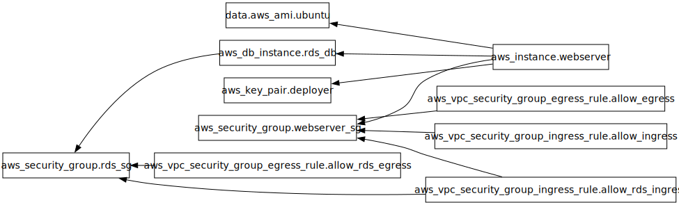

# 🚀 Deploy a PHP-MySQL Application on AWS using Terraform

A step-by-step Infrastructure as Code (IaC) project that deploys a PHP-MySQL application on AWS using **Terraform**. This project provisions the required AWS infrastructure, deploys the PHP application on an EC2 instance, stores application files in Amazon S3, and connects the application to an Amazon RDS MySQL database.

---

## 📌 Project Overview

This project demonstrates how to provision and configure AWS resources using Terraform, including:

- 🖥️ Amazon EC2 for hosting the PHP application
- 🗄️ Amazon RDS (MySQL) for the database
- 📦 Amazon S3 for application uploads/files
- 🔐 IAM Role for secure EC2 access to S3
- 🔥 Security Groups for controlled network access
- 📁 Terraform Remote Backend using S3
- 🔒 DynamoDB for Terraform State Locking

---

## 🏗️ Architecture



```text
                        GitHub Repository
                               │
                               │
                        Clone Application
                               │
                     +----------------------+
                     |     Amazon EC2       |
                     | Ubuntu + Apache2     |
                     | PHP Application      |
                     +----------+-----------+
                                │
                  +-------------+-------------+
                  │                           │
                  │                           │
           IAM Role for S3              MySQL Connection
                  │                           │
                  ▼                           ▼
           +--------------+          +----------------+
           |  Amazon S3   |          |  Amazon RDS    |
           | Upload Files |          |     MySQL      |
           +--------------+          +----------------+

Terraform Backend
-----------------
Amazon S3 (State File)
        +
DynamoDB (State Lock)
```

---

# 📂 Project Structure

```text
aws-deployment/
│
│── provider.tf
│── versions.tf
│── variables.tf
│── terraform.tfvars
│── outputs.tf
│── data.tf
│── networking.tf
│── security_group.tf
│── keypair.tf
│── iam.tf
│── s3.tf
│── ec2.tf
│── rds.tf
│── userdata.sh
│
│
├── screenshots/
│
└── README.md
```

---

# 🚀 Deployment Workflow

## Step 1 — Configure Terraform Remote Backend

Create a remote backend for storing the Terraform state.

Resources:

- Amazon S3 Bucket

Purpose:

- Store Terraform state remotely
- Prevent state corruption
- Enable state locking

---

## Step 2 — Configure AWS Provider

Configure:

- AWS Provider
- AWS Region
- Terraform Version

---

## Step 3 — Fetch the Latest Ubuntu AMI

Use a Terraform Data Source to automatically retrieve the latest Ubuntu LTS AMI.

Benefits:

- No hardcoded AMI IDs
- Always deploy the latest supported Ubuntu image

---

## Step 4 — Create an EC2 Key Pair

Generate or import an SSH Key Pair for secure access to the EC2 instance.

Purpose:

- SSH into EC2
- Server administration

---

## Step 5 — Create Security Groups

### EC2 Security Group

Allow:

- SSH (22)
- HTTP (80)
- HTTPS (443)

### RDS Security Group

Allow:

- MySQL (3306)

Only from the EC2 Security Group.

---

## Step 6 — Create an Amazon S3 Bucket

Provision an S3 bucket for storing application files.

Features:

- Versioning
- Server-side Encryption

Used for:

- Uploaded files
- Images
- Static assets

---

## Step 7 — Create an IAM Role

Create an IAM Role for the EC2 instance.

Permissions:

- Read objects from S3
- Upload objects to S3

Attach the role using an Instance Profile.

No AWS Access Keys are stored on the server.

---

## Step 8 — Launch the EC2 Instance

Provision an Ubuntu EC2 instance.

Using User Data, automatically install:

- Apache2
- PHP
- PHP MySQL Extension
- Git
- MySQL Client
- Composer

---

## Step 9 — Deploy the PHP Application

Automatically:

- Clone the GitHub repository
- Copy application files to Apache's web root
- Configure file permissions
- Restart Apache

---

## Step 10 — Create an Amazon RDS MySQL Instance

Provision a managed MySQL database.

Configuration:

- MySQL Engine
- Private Access
- Security Group
- Automated Backups

The database is accessible only from the EC2 instance.

---

## Step 11 — Configure the Database

From the EC2 instance:

- Connect to the RDS database
- Create the application database
- Import the SQL dump
- Verify the tables

Example:

```bash
mysql -h <RDS-ENDPOINT> -u admin -p
```

---

## Step 12 — Verify the Deployment

Test:

- EC2 is running
- Apache is serving the application
- PHP is working correctly
- Database connectivity
- File uploads to Amazon S3

---

# 📦 AWS Services Used

| Service | Purpose |
|----------|---------|
| Amazon EC2 | Host the PHP application |
| Amazon RDS | MySQL Database |
| Amazon S3 | Store uploaded files |
| IAM | Secure access to S3 |
| Security Groups | Network security |
| Amazon VPC | Networking |
| Terraform | Infrastructure as Code |

---

# 🛠️ Terraform Commands

## Initialize Terraform

```bash
terraform init
```

---

## Format Configuration

```bash
terraform fmt
```

---

## Validate Configuration

```bash
terraform validate
```

---

## Preview Infrastructure

```bash
terraform plan
```

---

## Deploy Infrastructure

```bash
terraform apply --auto-approve
```

---

## Destroy Infrastructure

```bash
terraform destroy --auto-approve
```

---

## Graph Infrastructure

```bash
terraform graph | dot -Tpdf > graph.pdf
```

---

# 🔐 Security Best Practices

- Store Terraform State in Amazon S3
- Enable State Locking using DynamoDB
- Use IAM Roles instead of AWS Access Keys
- Restrict MySQL access to the EC2 Security Group only
- Enable Server-side Encryption for S3
- Follow the Principle of Least Privilege
- Store sensitive values using Terraform Variables

---

# 📸 Screenshots

Add screenshots during each deployment stage.

- Terraform Apply
- AWS Console
- EC2 Instance
- Apache Homepage
- PHP Application
- Amazon S3 Bucket
- Amazon RDS
- Successful Database Connection

---

# 📚 Learning Objectives

By completing this project, you will learn how to:

- Provision AWS infrastructure using Terraform
- Configure a remote Terraform backend
- Deploy a PHP application on Amazon EC2
- Manage infrastructure using Infrastructure as Code
- Configure IAM Roles for secure AWS access
- Store application files in Amazon S3
- Connect an EC2 instance to an Amazon RDS MySQL database
- Secure AWS resources using Security Groups
- Automate server configuration using User Data

---

# 📈 Future Improvements

- Terraform Modules
- Multi-Environment Support (Development, Staging, Production)
- CloudWatch Monitoring
- AWS Secrets Manager for Database Credentials
- AWS Systems Manager (SSM) for EC2 Management
- AWS Backup for Amazon RDS

---

# 👨‍💻 Author

**Sazad Ahemad**

**Tech Stack**

- Terraform
- AWS
- Linux
- Apache2
- PHP
- MySQL
- Git

---

⭐ If you found this project helpful, consider giving it a star!